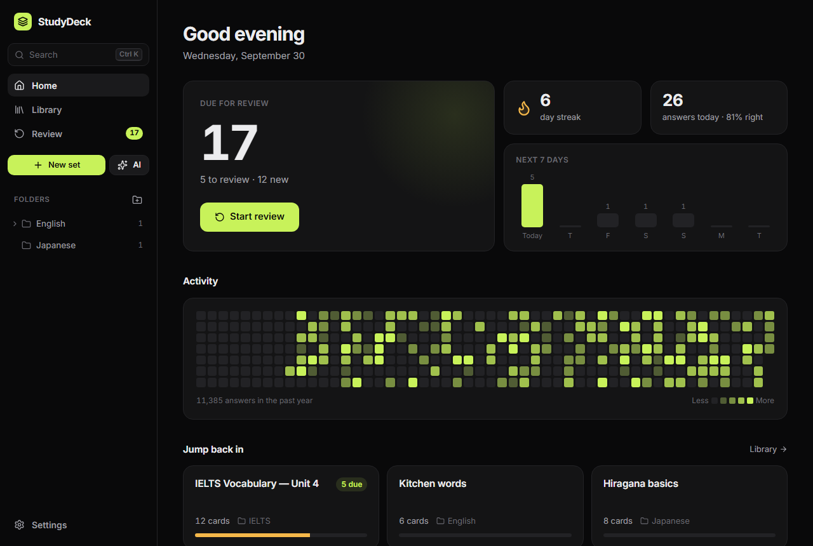
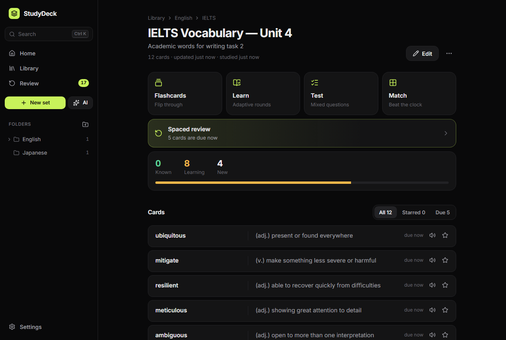
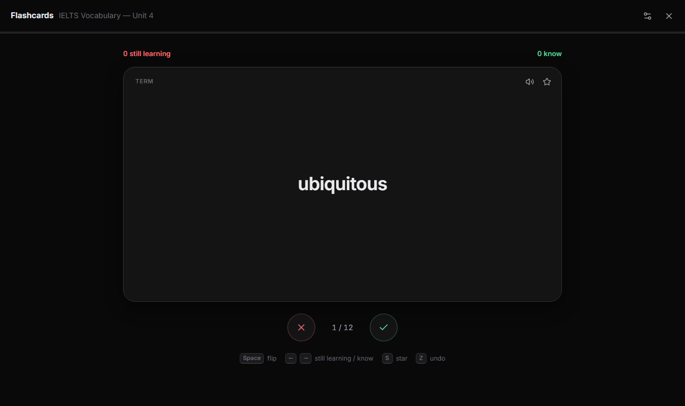
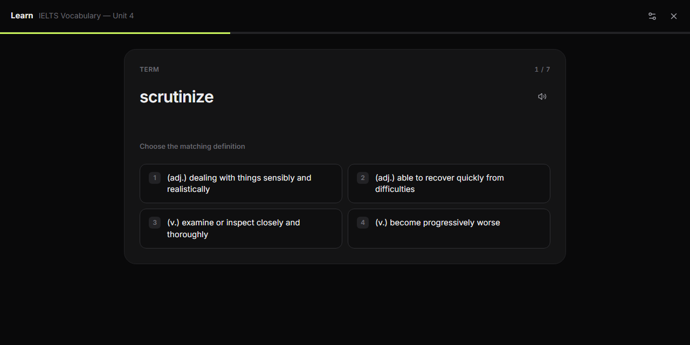
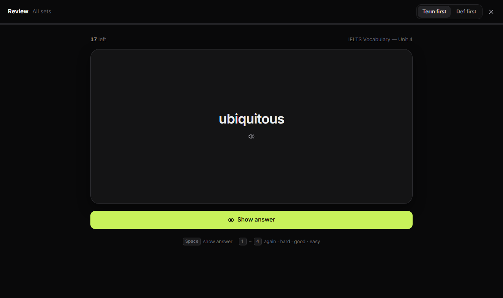

# StudyDeck

A personal flashcard app in the spirit of Quizlet — with a real spaced-repetition scheduler and
AI import from Claude or ChatGPT. Everything runs in the browser; your data never leaves your
device unless you export it.



## Features

**Study like on Quizlet**

- **Flashcards** — flip, shuffle, star, text-to-speech, swipe on mobile, and “still learning / know” sorting.
- **Learn** — adaptive rounds: multiple choice first, then typed answers until a card is mastered. Missed cards come back in the same round.
- **Test** — generate a test with true/false, multiple choice, written and matching questions, then see a graded report.
- **Match** — clear the board against the clock; your best time is saved per set.

**Remember it long-term**

- **Spaced review** powered by [FSRS](https://github.com/open-spaced-repetition/ts-fsrs) (the scheduler behind modern Anki), with Again / Hard / Good / Easy and the next interval shown on each button.
- Daily review queue across all sets, new-cards-per-day limit, adjustable target retention.
- **Reminders**: a daily browser notification, a badge on the installed app icon, and a one-click calendar event (`.ics`) for a reminder that always arrives.
- Streak, today's accuracy, 7-day forecast and a one-year activity heatmap.

**Get content in fast**

- **AI import** from a word list _or_ any text/notes, in several card styles (English definition, IPA + example, collocations, Vietnamese meaning, Q&A, or your own instructions).
  - With an API key: Claude, ChatGPT (OpenAI) or Gemini, called directly from the browser.
  - Without a key: copy the prompt into claude.ai or chatgpt.com, paste the reply back — StudyDeck reads it.
- Paste import from Quizlet exports, spreadsheets or notes (tab, comma, dash, colon or custom separators).
- Folders (nested), search everything with <kbd>Ctrl</kbd> <kbd>K</kbd>, export a set as TSV, full JSON backup/restore.

**Polished**

- Black-first design with five accent colours, keyboard shortcuts everywhere, mobile layout with bottom tabs.
- Installable PWA that works offline.

| Set page                             | Flashcards                             |
| ------------------------------------ | -------------------------------------- |
|      |  |
| **Learn**                            | **Spaced review**                      |
|  |  |

## Getting started

Requires Node.js 22 or newer.

```bash
npm install
npm run dev
```

Open http://localhost:5173. Add `?demo` to the URL in development to load sample data
(this replaces whatever is stored locally).

| Script            | What it does                                   |
| ----------------- | ---------------------------------------------- |
| `npm run dev`     | Start the dev server                           |
| `npm run build`   | Type-check and build to `dist/`                |
| `npm run preview` | Serve the production build locally             |
| `npm test`        | Run unit tests (Vitest)                        |
| `npm run lint`    | ESLint                                         |
| `npm run format`  | Prettier                                       |
| `npm run icons`   | Regenerate PWA icons from `public/favicon.svg` |

## Deploying

The app is hosted on Netlify at https://flashcardhaiii.netlify.app. Build settings live in
`netlify.toml` (`npm run build` → `dist/`), so once the GitHub repo is linked to the Netlify
project (**Project configuration → Build & deploy → Link repository**), every push to `main`
deploys automatically and pull requests get preview URLs.

GitHub Actions (`ci.yml`) runs lint, tests and a build on every push and pull request.

The build uses a relative base path and hash routing, so the same `dist/` also works on Vercel,
Cloudflare Pages, GitHub Pages or any static host without changes.

## AI import

Open **Settings → AI import**, pick a provider and paste an API key:

| Provider | Where to get a key                          | Default model         |
| -------- | ------------------------------------------- | --------------------- |
| Claude   | https://console.anthropic.com/settings/keys | `claude-opus-5-5`     |
| ChatGPT  | https://platform.openai.com/api-keys        | `gpt-5`               |
| Gemini   | https://aistudio.google.com/apikey          | `gemini-flash-latest` |

Keys are stored only in this browser's `localStorage` and sent directly to the provider — there is
no backend. That's fine for a personal app on your own device; don't paste a key on a shared computer.

No key? Choose **Via Claude.ai / ChatGPT** in the import dialog: StudyDeck copies a prompt and opens
the chat, you paste the reply back.

## Reminders — what works where

A static site can't wake itself up on a schedule, so StudyDeck combines three things:

1. **Notification** at your chosen time while StudyDeck is open in a tab or installed as an app.
2. **App badge** with the number of due cards (installed app, Chromium browsers).
3. **Calendar event** (`.ics`, daily repeat) — import it into Google Calendar / Apple Calendar /
   Outlook for a reminder that arrives even when the browser is closed.

## Data & backups

All sets, progress and settings live in `localStorage` under `studydeck.v3`. Use
**Settings → Data → Export** regularly; **Import** accepts both StudyDeck 3 backups and the
`studydeck-backup.json` files from the old single-file StudyDeck 2. When opened on the same
origin as StudyDeck 2, existing data is migrated automatically on first launch (old review levels
are converted to FSRS with their due dates kept).

## Project structure

```
src/
  lib/            framework-free logic (unit-tested)
    srs.ts          FSRS wrapper + StudyDeck 2 migration
    grading.ts      forgiving answer checking
    parse.ts        paste import + AI reply parsing
    backup.ts       export / import / merge
    reminders.ts    notifications, app badge, .ics
    ai/             prompts + Claude / OpenAI / Gemini clients (lazy-loaded)
  store/          Zustand store (persisted), selectors, UI state
  components/     layout, dialogs, command palette, shared UI
  features/       pages: home, library, sets, editor, study modes, settings, ai
  styles/         design tokens and global CSS
```

Tech: React 19, TypeScript, Vite, React Router (hash mode), Zustand, ts-fsrs, Anthropic SDK,
vite-plugin-pwa, Vitest.

## Roadmap ideas

- Images on cards
- Cloud sync between devices (e.g. Supabase) instead of manual backups
- Blocks-style game and a “Spell” audio mode
- Per-card AI explanations and example sentences

## License

[MIT](LICENSE)
